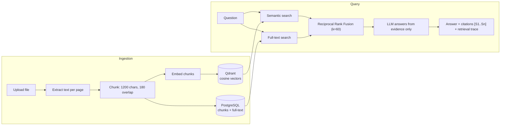

# 🔎 Atlas RAG

**Ask questions across your own documents and get answers with inline source citations.**
Hybrid retrieval (semantic vectors + PostgreSQL full-text search) merged with Reciprocal Rank Fusion, served through a FastAPI backend and a built-in web workbench.


**Jump to:** [How it works](#-how-it-works) · [Quick start](#-quick-start) · [API](#-api) · [Design decisions](#-design-decisions) · [Evaluation](#-evaluation) · [Limitations](#-limitations)

---

## ✨ What it does

- **Ingests** PDF, DOCX, TXT, Markdown, HTML and CSV files (up to 25 MB each by default).
- **Answers questions** using only the retrieved evidence, with `[S1]`, `[S2]`... citations that link back to file name, page and an excerpt.
- **Searches hybrid:** meaning-based (Qdrant) and keyword-based (PostgreSQL full-text) results are fused, so exact names and identifiers stay findable.
- **Generates cited reports** from a topic using a fixed plan → retrieve → synthesize workflow.
- **Shows its work:** every chat response includes a retrieval trace (candidate counts, fusion method, semantic scores).
- **Web workbench** served by FastAPI at `/`: drag-and-drop uploads, ingestion-status polling, document-scoped search, expandable source evidence, report view. No separate frontend build.

---

## 🧠 How it works



<details>
<summary><b>Retrieval details (click to expand)</b></summary>

1. The question is embedded and searched in Qdrant (`top_k × 3` candidates).
2. The same question runs through PostgreSQL `websearch_to_tsquery`, ranked with `ts_rank` (`top_k × 3` candidates).
3. Ranks from both lists are fused: `score = Σ 1 / (60 + rank)`. RRF needs no score normalization, which matters because cosine similarity and `ts_rank` live on different scales.
4. The top `top_k` chunks (default 6, allowed 1–20) go to the LLM with a system prompt that says: answer only from the evidence, cite every claim as `[S#]`, and say so if the evidence is insufficient.
5. If nothing is retrieved, the API says so instead of answering from the model's own knowledge.

</details>

<details>
<summary><b>Ingestion details (click to expand)</b></summary>

- Extraction: `pypdf` (PDF, page-aware), `python-docx`, `BeautifulSoup` (HTML), plain text/Markdown, CSV.
- Chunking is paragraph-aware and character-based (1200 characters, 180 overlap), preferring sentence boundaries, and keeps the source page number on every chunk.
- Ingestion runs as a background task after the upload returns `202`. A document moves through `processing` → `ready` or `failed` (with the error stored), so the UI can poll status.
- Embeddings are requested in batches of 96.

</details>

---

## 🧰 Tech stack

| Layer | Technology |
|---|---|
| API | FastAPI, Uvicorn, Pydantic Settings |
| Database | PostgreSQL 16 (SQLAlchemy 2.0 async, asyncpg, Alembic migrations) |
| Vector store | Qdrant v1.12 (cosine distance, per-document filtering) |
| LLM + embeddings | OpenAI-compatible API. Defaults: `gpt-4o-mini` for answers, `text-embedding-3-small` (1536 dims) for embeddings |
| Document parsing | pypdf, python-docx, BeautifulSoup |
| Packaging | Docker, Docker Compose |
| Tests | pytest, pytest-asyncio |

---

## 🚀 Quick start

**You need:** Docker and an OpenAI API key (or any OpenAI-compatible endpoint).

```bash
git clone https://github.com/Sajal-10903/Atlas-RAG.git
cd Atlas-RAG
cp .env.example .env        # then set OPENAI_API_KEY
docker compose up --build
```

- Web workbench: http://localhost:8000
- Interactive API docs: http://localhost:8000/docs

<details>
<summary><b>Run without Docker</b></summary>

```bash
# 1. start PostgreSQL and Qdrant locally, then:
pip install -r requirements.txt
alembic upgrade head
uvicorn app.main:app --reload
```

</details>

<details>
<summary><b>Offline smoke test (no embeddings API)</b></summary>

Set `EMBEDDING_PROVIDER=local` to use deterministic hash vectors. This only verifies that ingestion works end to end. It is **not** a substitute for semantic embeddings, and chat/report generation still needs an LLM key.

</details>

<details>
<summary><b>Configuration (.env)</b></summary>

| Variable | Default | Purpose |
|---|---|---|
| `OPENAI_API_KEY` | (empty) | Required for embeddings and answers |
| `OPENAI_BASE_URL` | `https://api.openai.com/v1` | Point to any OpenAI-compatible endpoint |
| `CHAT_MODEL` | `gpt-4o-mini` | Answer/report model |
| `EMBEDDING_MODEL` | `text-embedding-3-small` | Embedding model |
| `EMBEDDING_DIMENSIONS` | `1536` | Must match the Qdrant collection |
| `EMBEDDING_PROVIDER` | `openai` | `local` for offline smoke tests only |
| `DATABASE_URL` | postgres (asyncpg) | Metadata + full-text index |
| `QDRANT_URL` / `QDRANT_COLLECTION` | `http://qdrant:6333` / `atlas_chunks` | Vector store |
| `MAX_UPLOAD_MB` | `25` | Upload size limit |

</details>

---

## 📡 API

| Method | Endpoint | Description |
|---|---|---|
| `POST` | `/api/v1/documents` | Multipart upload. Returns `202` with a document id and starts ingestion |
| `GET` | `/api/v1/documents` | Latest indexed documents |
| `GET` | `/api/v1/documents/{id}` | Ingestion status and metadata |
| `POST` | `/api/v1/chat` | `{question, document_ids?, top_k?}` → answer, citations, retrieval trace |
| `POST` | `/api/v1/reports` | `{topic, document_ids?, format?}` → cited report + workflow steps |
| `GET` | `/health` | Liveness check |

```bash
# upload, then ask
curl -F "file=@paper.pdf" http://localhost:8000/api/v1/documents
curl -X POST http://localhost:8000/api/v1/chat \
  -H "Content-Type: application/json" \
  -d '{"question": "What are the main findings?", "top_k": 6}'
```

Unsupported file types return `415`; files over the limit return `413`.

---

## 🧭 Design decisions

- **Hybrid over vectors-only.** Embeddings capture meaning but can miss exact identifiers, names and codes. Full-text search catches those, so both are used.
- **RRF over score blending.** Cosine similarity and `ts_rank` are not comparable, so fusing by rank avoids tuning weights.
- **Metadata and vectors are stored separately.** PostgreSQL holds durable chunk text, page numbers and status; Qdrant holds only vectors and the document id for filtering.
- **The model is constrained to the evidence.** The prompt forbids unsupported claims, and the citation list is built from the retrieved chunks, not from model output.
- **The "research agent" is intentionally a fixed workflow** (three sub-questions → hybrid retrieval → synthesis) rather than an autonomous loop, so each step is observable and testable.

---

## 📂 Project structure

```text
Atlas-RAG/
├── app/
│   ├── main.py, config.py, db.py
│   ├── api/routes.py            # documents, chat, reports, health
│   ├── services/                # extraction, chunking, ingestion, llm, vector_store, retrieval
│   ├── agents/research.py       # cited report workflow
│   ├── models/, schemas/        # SQLAlchemy entities, Pydantic contracts
├── alembic/                     # database migrations
├── frontend/                    # static web workbench (HTML/CSS/JS)
├── scripts/evaluate.py          # retrieval evaluation (MRR@10)
├── tests/                       # pytest
├── Dockerfile, docker-compose.yml, .env.example
```

---

## 📊 Evaluation

A retrieval evaluation script is included: it takes a JSON list of `{"question", "expected_document_ids"}` cases, runs the hybrid retriever and reports **MRR@10**.

```bash
python scripts/evaluate.py --dataset eval.json
```

Benchmark results on a real corpus have not been published yet. Unit tests currently cover chunking and API schema contracts (`pytest`).

---

## ⚠️ Limitations

- No authentication or multi-tenancy. Anyone who can reach the API can upload and query.
- Ingestion uses in-process background tasks, not a durable queue.
- Chunking is character-based, and there is no re-ranking stage after fusion.
- Answer quality depends on the configured LLM and embedding model; retrieval quality has not been benchmarked yet (see above).
- Not implemented yet: OAuth/RBAC, task queue, object storage, rate limiting, structured logging/tracing.

---

**Author:** [Sajal Raj](https://github.com/Sajal-10903) · [Portfolio](https://sajalraj-portfolio.vercel.app) · [LinkedIn](https://www.linkedin.com/in/sajal-raj-456b31252/)
